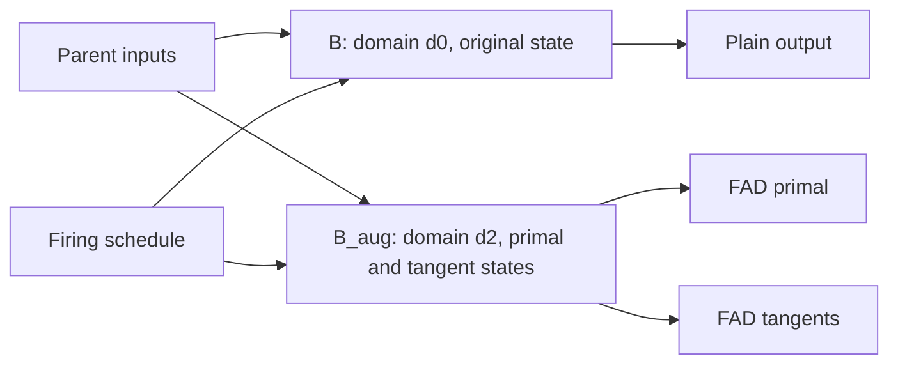

# FAD, clock domains and state: model and review of the fixes

Date: 2026-09-19. Reviewed revision:
`f18a50c8130684f2988c859d20544fc3b96773f1`, including `21252f16` and `9e5d9320`.

This document explains the behavior implemented at this revision. It
complements the [FAD/RAD cohabitation plan](ondemand-fad-rad-cohabitation-2026-06-10-en.md),
whose initial assumption that the original and augmented blocks could reuse
one domain was insufficient. Review experiments are recorded in §9; limits
and a remaining defect are described in §10.

## 1. Verdict and scope

The change specific to **`f18a50c8` is correct in the examined cases**: a
bargraph passes its input signal through, so it must also pass the tangent
through. The `VBargraph` and `HBargraph` arms rebuild the primal from the
transformed signal and return `dual.tangents`. Numerical tests, including
second derivatives and intermittent clocks, support this rule.

The subtree and table reconstruction fixes requested in the earlier review
are in its parent, **`21252f16`**. They address regressions in `9e5d9320`:
the twin must rebuild references to its state even in parts whose derivative
is zero. The previous bargraph and mutable-table witnesses are now covered
by a passing test matrix. The shared-domain witness no longer imports
`stdfaust.lib`.

**The overall domain repair is nevertheless incomplete.** Nested
`upsampling` whose factor reads an input of the enclosing block is still
rejected: `ZeroPad(u, h)` retains `h` without rebuilding its annotations.
The new invariant check detects the old domain. See the reproducer in §10.
This is not a regression introduced by the two bargraph changes in
`f18a50c8`.

These results validate the tested fixes, not every combination of AD and
clocks. In particular, the bargraph correction applies to **FAD**. The
symbolic **RAD** path still treats bargraphs as contributing zero at this
revision (§10).

## 2. A clock and a domain are different things

The **clock** specifies when, or how many times, to execute a block. The
**domain** identifies one instance of that block in the program's temporal
hierarchy. Two instances can have identical clocks and still require
different storage.

| Construct | Execution in the parent's time | Inputs and outputs |
|---|---|---|
| Boolean-clock `ondemand` | One execution when the condition is true | Snapshot inputs; hold the last output between executions |
| Positive integer-count `ondemand`, count `H` | `H` iterations per parent tick | Same input snapshot throughout those iterations; hold the last output |
| `upsampling`, positive factor `H` | `H` iterations per parent tick | Zero inputs except on the last iteration; hold the final output |
| `downsampling`, positive factor `H` | One execution every `H` parent ticks | Snapshot inputs on execution; hold the output between executions |

This table describes the usual positive cases; it does not redefine the
policy for invalid factors. Propagation already simplifies constant clocks
`0` and `1` into zero outputs and direct body propagation, respectively.
A test using only `(1, x) : ondemand(...)` may therefore exercise no actual
domain boundary.

A delay written **inside the body** advances in the block's local time. A
delay computed **before the boundary** and supplied as an input advances
in the parent domain. This distinction also applies to recursion, table
indices and local counters.

Example: an accumulator initialized to zero, with an intermittent boolean
clock.

| Parent sample | 0 | 1 | 2 | 3 | 4 |
|---|---|---|---|---|---|
| Clock | 0 | 1 | 0 | 1 | 0 |
| Input `x` | 10 | 20 | 30 | 40 | 50 |
| Cumulative executions | 0 | 1 | 1 | 2 | 2 |
| Output of `ondemand(+ ~ _)` | 0 | 20 | 20 | 60 | 60 |

The accumulator's delay has advanced only twice.

## 3. How the signal graph represents this model

`propagate_clocked_wrapper` in
[`engine.rs`](../crates/propagate/src/engine.rs) constructs, schematically:

```text
parent inputs
    → TempVar / double_clocked(parent, inner domain)
    → block body
    → PermVar(Clocked(τ, output))

B = OnDemand(Clocked(τ, H), held output 0, held output 1, ...)
public output i = Seq(B, held output i)
```

The diagram omits details of the input wrappers; `upsampling` adds
`ZeroPad`. Each operator has a different responsibility:

- `TempVar` materializes an input snapshot.
- `Clocked(τ, u)` carries the domain annotation. `τ` is an opaque token,
  **not a numerical signal to differentiate**.
- `PermVar` materializes a value held between executions.
- `OnDemand` / `Upsampling` / `Downsampling` represent the executable block.
- `Seq(B, y)` requires the block execution needed to read `y`, and exposes
  that result in the parent domain.

The token contains an identifier in the
[`ClockDomainTable`](../crates/propagate/src/clock_domain.rs), which records
the parent, block kind and provenance. Inference in
[`clk_env`](../crates/transform/src/clk_env/mod.rs) checks ancestry: a
signal from a sibling domain is not an implicitly accessible local input.
This explains the `FRS-SFIR-0008` failures when an original and its twin
were mixed.

An annotation does not execute an `if` or loop by itself. Preparation,
scheduling and FIR lowering implement execution from the graph and its
domains.

## 4. What FAD must preserve

For parameters `θ₀, …, θₙ`, FAD transforms each output into:

```text
[primal value, derivative with respect to θ₀, ..., derivative with respect to θₙ]
```

The **primal** computes the value. The **tangents** compute its derivatives.
Seeds are recognized by signal-node identity. Recursions are rewritten with
interleaved slots `[primal state, tangent states…]`, so `Proj` indices must
follow that new layout.

Consider a block that executes this update at its local tick `k`:

```text
s(k+1) = a · s(k) + g · x(k)
```

For `a` independent of `g`, its sensitivity `q = ∂s/∂g` must execute:

```text
q(k+1) = a · q(k) + x(k)
```

Both updates occur **at the same local tick**, using the same input
snapshot. While the block does not execute, its primal and tangent outputs
remain held. If `a` itself is the differentiation parameter, the rule is
`q(k+1) = a · q(k) + s(k)`: it must read the previous state.

Boundary rules express that synchronization:

| Operation | Tangent transformation |
|---|---|
| Snapshot | Snapshot the tangent at the same firing |
| Hold | Hold the tangent between the same firings |
| Zero-padding | Apply the primal's iteration mask |
| Local delay / recursion | Advance tangent state with primal state |

These rules are exact for supported differentiable primitives and a firing
schedule independent of the parameters. When the schedule depends on a
parameter, the policy from the
[plan, §5](ondemand-fad-rad-cohabitation-2026-06-10-en.md#5-the-mathematics-differentiation-commutes-with-the-boundary)
is to ignore derivatives of discrete firing decisions. The result is the
sensitivity along the decisions taken, not a derivative of changes in
firing instants or iteration counts.

## 5. One augmented block, but two instances if the original is still used

Two situations must be distinguished.

**FAD inside the block body.** The body directly produces values and their
derivatives. The block's wrappers carry all these outputs in its domain.
If the differentiated expression itself contains a nested block, the
augmentation rule applies at that inner boundary.

**FAD around a block.** The transformer encounters the `Seq(B, y)` nodes
already produced by propagation. It builds one augmented version `B_aug`,
memoized in `od_aug_cache`. Consumers of that augmentation's primal and
tangents all refer to **the same `B_aug`**. They must not execute the body
separately for each derivative.

However, another program consumer can still request the output of `B`
outside FAD. In that case both blocks remain live:



The diagram assumes a common schedule independent of the parameter. When
a clock reads internal block state, each instance reads its own equivalent
state, rather than shared storage for that clock.

The initial plan's phrase “one block, not two” referred to the primal and
tangents **within one augmentation**. It does not guarantee that the
entire program stops using the original. Reusing `B`'s domain for `B_aug`
made two executable blocks share delays and counters: the first could
advance a delay subsequently read by the second at the same parent tick.

Since `9e5d9320`, `augment_block` allocates a fresh domain. Pure arithmetic
can remain shared; the instances' local state must be separate. The
primal and tangents of `B_aug` have distinct state slots while advancing
in **its same local time**.

This has a cost: when both versions are actually consumed, both the
original and augmented bodies are computed. Avoiding that duplicate work
would be a further optimization requiring equivalence of state, schedule
and observable effects.

## 6. The twin's reconstruction invariant

A zero derivative does not mean a subtree can be kept unchanged in another
domain. A delay of `x` can be independent of `g` while still belonging to
the block being copied.

The implemented structural obligation is: **no token of an original domain
being twinned, or of any descendant of that domain, may remain reachable
in the twin's payload**. This includes its clock. Dependencies outside the
copied domain do not thereby become local state: their sampling boundaries
must be preserved.

The steps in [`forward_ad.rs`](../crates/propagate/src/forward_ad.rs) are:

1. `augment_block` obtains the original domain from a held output and
   allocates a fresh domain of the same kind. If the parent is also being
   twinned, the new domain is attached to the new parent.
2. `env_rename` maps old tokens to new ones; `domain_rename` maps domain
   identifiers. The `Clocked` rule replaces the token while transforming
   the wrapped signal.
3. `needs_rebuild` examines reachable tokens and follows their parents
   through `token_is_being_twinned`. A nested block without inputs can
   thus be recognized as belonging to the copy **before** its own token
   has been entered in the rename map.
4. `zero_tangent` calls `rebuild_primal` when necessary. Paths without a
   derivative rule rebuild their primal over transformed children instead
   of reintroducing the old state.
5. `transform_rdtbl` also transforms the table, not just its read index.
   The bargraph arms rebuild their wrapped signal.
6. The completed payload is scanned for surviving original domains. A
   violation produces `FadTwinKeepsOriginalDomain`, identified as a
   compiler-transformer defect.

Nested domains must end up shaped like this:

```text
original: parent → d0 → d1
twin:     parent → d2 → d3
```

Keeping `d1` beneath `d2` is not acceptable merely because `d1`'s computation
does not depend on the seed. It belongs temporally to `d0`.

The clock needs particular care. **Not differentiating its schedule does
not permit keeping its old graph.** `augment_block` uses
`transform(clock).primal`. A condition fed by a solver's output flag must
read the transformed recursion's flag, using the correct projection
indices. Commit `1251c085` addressed that issue before domain separation.

The domain table supplies identity, ancestry and provenance. Its `clock`
and `inputs` fields are identifiers from the propagation arena; they must
not be dereferenced against a cloned arena. The in-graph payload carries
the transformed clock and outputs for later passes, as documented in
`clock_domain.rs`.

## 7. The bargraph-specific correction

For the signal computation:

```text
meter(u) = u
d meter(u) / dθ = du / dθ
```

A bargraph also has a UI metering effect. The correct rule is:

```text
dual = transform(u)
primal   = meter(dual.primal)
tangents = dual.tangents
```

The primal retains the meter. No additional bargraph is placed on each
tangent, which would meter derivatives into the same control location.

For example, for `y = x * g * g : hbargraph(...)`:

```text
y       = x · g²
dy/dg   = 2 · x · g
d²y/dg² = 2 · x
```

`21252f16` fixed reconstruction of the bargraph's primal but still returned
a zero tangent. `f18a50c8` fixes that second error, which also existed
outside any clock domain.

Conversely, rebuilding a mutable table to separate its writes does not
create a mathematical derivative rule for its contents. In
`rwtable(...) * g`, the derivative with respect to `g` can correctly be
nonzero while the table itself remains in the zero-tangent subset. The
two obligations—preserving the primal and computing the supported
derivative—must be examined separately.

## 8. Why three oscillators hid the cause

Propagation memoization in
[`result_memo.rs`](../crates/propagate/src/result_memo.rs) activates after a
1,024-call warm-up. Its key includes the slot context, UI path, box node,
inputs and propagation context, including the parent domain.

Once active, two references to the same definition in the same context can
replay **the same propagated instance**, including its domain. A small
program instead propagates the references separately. Incorrect domain
reuse by FAD was then masked because the second propagation had already
created a different instance.

The oscillators were therefore not a mathematical requirement of the bug:
they crossed the memoization threshold. The new witness uses 576 constants
in nested `par` expressions without importing a library. It also checks
the emitted C++ domain suffixes: `_d0`, `_d1`, `_d2`, `_d3`. A second
propagation would have introduced extra identifiers before the twin's.

This assertion deliberately depends on the current numbering. If
allocation or warm-up changes, the witness must be revised with evidence
that it still exercises initial instance sharing, rather than simply
updating the suffix list until the test passes.

## 9. Review validation

The following commands were executed at `f18a50c8`:

```sh
cargo test -p compiler --test ondemand_pipeline --test fad_recursive_runtime
cargo test -p propagate --all-targets
cargo test -p compiler --test rad_runtime --test block_reverse_ad \
  --test clocked_shared_box_one_domain --test clocked_emission_structure
cargo run -p xtask -- golden-check
```

| Group | Result |
|---|---|
| `ondemand_pipeline` | 44 tests passed |
| `fad_recursive_runtime` | 17 tests passed |
| `propagate`, all targets | 113 tests passed |
| RAD, block reverse AD, block sharing, emission structure | 89 tests passed, 1 already ignored |
| Rust goldens | 205 cases passed |

At this revision, `fad_beside_plain_owns_every_subtree_of_the_block` covers
**12 bodies × 3 wrappers × 2 optimization levels = 72 cases**. The count
of 66 in the `21252f16` report refers to 11 bodies, before `f18a50c8` added
the output bargraph. The matrix compares the original with the augmented
primal; for bodies proportional to `g`, it also checks
`tangent = primal / g`.

Temporary review probes, without external libraries, supplemented this
suite. They were not added to the versioned tests:

- Boolean clock `0,1,0,1,1,0,0,1`, local accumulator `s`, and output
  `g²*s + h*s²` passed through each bargraph kind. With `g=0.5` and
  `h=0.3`, independent checks of the output and derivatives `2*g*s` and
  `s²`, at optimization levels 0 and 6.
- The same clock, recursion `s_next = g*s + h*x`, output bargraph, and
  only the two tangents consumed. Explicit oracle
  `dg_next = g*dg + s`, `dh_next = g*dh + x`; holding between firings
  checked at levels 0 and 6.
- Two nested `fad` calls around `x*g*g : hbargraph(...)`, under each of
  the three wrappers with factor 2. Checks of `2*g*x` and then `2*x`,
  with the domain's corresponding sampling, at levels 0 and 6.

These three probes pass, covering 12 additional configurations. A fourth
probe observes the pre-existing RAD defect below; it does not validate
that RAD derivative as correct.

A further probe of nested variable-factor `upsampling` **fails** with
`FadTwinKeepsOriginalDomain`. Its controls pass: the same block without
FAD, the version with an inner `ondemand`, and the constant-factor
version. Details and the reproducer are in §10.

`cargo run --release -p xtask -- compile-budget-check` was also attempted.
It refuses to conclude because the `karplus.dsp` calibration takes 3 ms,
below its 4 ms minimum. No baseline was changed. This neither validates
compilation cost nor demonstrates a cost regression.

## 10. What these results do not establish

### Remaining defect: the variable `ZeroPad` factor is not rebuilt

At `f18a50c8`, this program is rejected during propagation:

```faust
g = hslider("g", 0.5, 0, 1, 0.01);
body(x) = (int(x), x) : upsampling(*(g));
block(x) = (2, x) : ondemand(body);
process(x) = block(x), fad(block(x), g);
```

The diagnostic says that the twin still reaches a signal of the original
domain (`FadTwinKeepsOriginalDomain`). The cause is the
`SigMatch::ZeroPad(u, h)` arm: it transforms `u` but uses the original `h`
in both primal and tangents. Here, `h = int(x)` contains an annotation of
the enclosing domain being twinned.

Not differentiating the schedule does not eliminate the need to rebuild
its primal. The transformed primal value of `h` is needed, as it is for
the block's clock. The check added by `21252f16` therefore works, but
reconstruction is not yet exhaustive.

With positive inputs `1,2,3,4`, the block without FAD correctly produces
`0.5,1,1.5,2`. The differentiated version compiles and gives the expected
values if `upsampling` is replaced by `ondemand`, or if `int(x)` is
replaced by constant factor `2`. The existing matrix does not cover this
combination of nesting and variable factor. This review records the defect
without changing the compiler.

### The domain check is an internal assertion, not an independent proof

The scan added to `augment_block` is useful: it detects an old token that
escaped reconstruction and improves the diagnostic. However, it reuses
`env_tokens_in`, `token_is_being_twinned` and the rename tables used by the
transformer itself.

It is therefore not an independent checker in the sense of the
[checker independence plan](clock-ad-checker-independence-plan-2026-07-20-en.md).
A common error in traversal or ancestry can affect both production and
checking. The mutation test reported in the
[journal](journal/2026-09-19.md) demonstrates detection of disabled
reconstruction; this review did not rerun that mutation. By itself, the
check does not validate derivative formulas, execution counts, recursion
indices or numerical values either.

### Correcting FAD bargraphs does not repair all AD

The symbolic traversal in
[`reverse_ad.rs`](../crates/propagate/src/reverse_ad.rs) still excludes
the contribution of a bargraph's wrapped signal. A probe using
`t = (+(1)) ~ _` and `t*g : hbargraph(...)` produces FAD derivatives
`1,2,3,4` and RAD derivatives `0,0,0,0` for its first four samples.
This is a pre-existing defect, outside the `f18a50c8` change, to address
separately.

Mutable tables, foreign functions without rules and other zero-tangent
families do not become differentiable merely because their domains are
correctly rebuilt. The family table in the `forward_ad.rs` documentation
is also partly historical: `TempVar` and `PermVar` now have explicit
tangent-propagation arms. The actual match arms and tests are the
reference for this review.

### Sharing and cost still need attention

Three kinds of sharing serve different purposes: propagation memoization
retrieves the source instance; the transform cache shares differentiated
expressions; `od_aug_cache` avoids constructing a block per consumer or
tangent. Scope changes, especially de Bruijn binders, need separate care:
the signal cache is already scoped when entering and leaving recursions.
The token invariant cannot validate every interaction between these
caches.

Numerical success measures neither the compilation cost of reconstruction
nor the runtime cost of the two instances. It does not justify fusing their
state without further evidence.

### Validation scope

The results above cover the interpreter and the structural/snapshot
checks run locally. This review is not a full CI run on all three systems,
nor fresh numerical validation of every backend. FAD and AD × clock-domain
composition are Rust extensions: the C++ reference supplies the clock
model, not a differentiation oracle for this combination.

## 11. Maintenance references

| Subject | Reference |
|---|---|
| Boundary construction, recursion annotations, active clock | [`propagate/src/engine.rs`](../crates/propagate/src/engine.rs) |
| Domain identity and ancestry | [`propagate/src/clock_domain.rs`](../crates/propagate/src/clock_domain.rs) |
| Instance replay and warm-up threshold | [`propagate/src/result_memo.rs`](../crates/propagate/src/result_memo.rs) |
| Differentiation, reconstruction, augmentation and assertion | [`propagate/src/forward_ad.rs`](../crates/propagate/src/forward_ad.rs) |
| Diagnostic for a twin retaining an old domain | [`propagate/src/error.rs`](../crates/propagate/src/error.rs) |
| Domain compatibility in the resulting graph | [`transform/src/clk_env/mod.rs`](../crates/transform/src/clk_env/mod.rs) |
| Boundary and instance regressions | [`compiler/tests/ondemand_pipeline.rs`](../crates/compiler/tests/ondemand_pipeline.rs) |
| Bargraphs and differentiated recursion | [`compiler/tests/fad_recursive_runtime.rs`](../crates/compiler/tests/fad_recursive_runtime.rs) |
| Fix history | [`journal/2026-09-19.md`](journal/2026-09-19.md) |

For a future change, answer three distinct questions: **does the primal
still compute the same result? Does every state belong to the correct
temporal instance? Does the tangent implement the stated mathematical
rule?** Successful compilation alone, or equality between original and
primal alone, does not answer all three.
